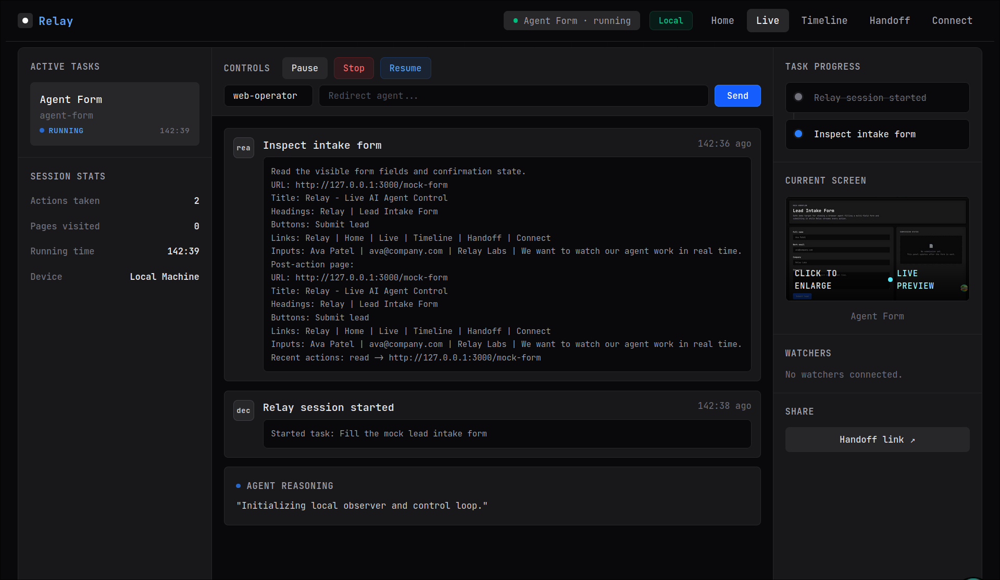
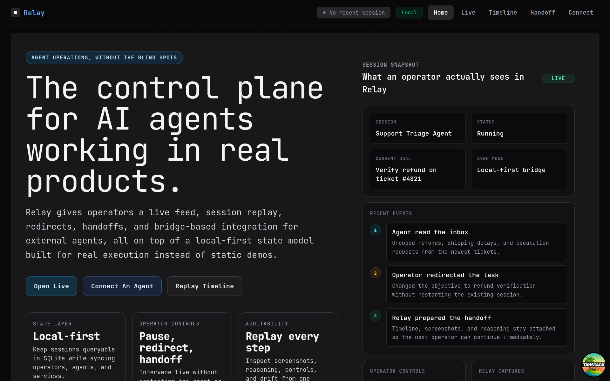
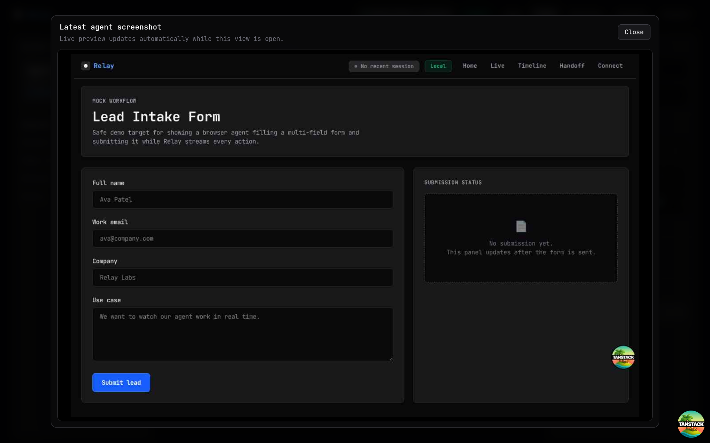
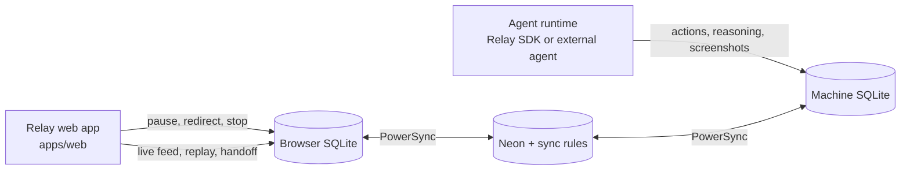
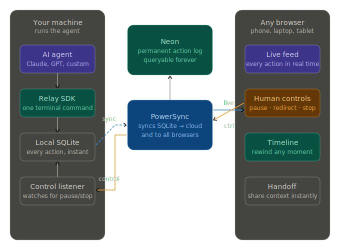

<div align="center">
  <h1>Relay</h1>
  <p><strong>The control plane for AI agents working in real products.</strong></p>
  <p>Relay gives operators a live feed, session replay, redirects, handoffs, and bridge-based integration on top of a local-first state model.</p>
  <p>
    
    
    
    
    
    
  </p>
  <p>
    <a href="#quickstart">Quickstart</a> ·
    <a href="#screens">Screens</a> ·
    <a href="#how-it-works">How It Works</a> ·
    <a href="#workspace">Workspace</a> ·
    <a href="./docs/ARCHITECTURE.md">Architecture Notes</a>
  </p>
</div>

<p align="center">
  
</p>

Relay was built for the PowerSync AI Hackathon, but the repo is aimed at a real operating model: an agent runs locally, operators watch it in the browser, and the same session can be paused, redirected, replayed, and handed off without losing context.

## Why Relay

- Watch actions, screenshots, reasoning, drift alerts, and operator controls in one session view.
- Intervene live with pause, resume, redirect, and stop instead of restarting the agent loop.
- Replay a run step-by-step with timeline scrubbing and screenshot recovery.
- Hand a session to another operator with share context and resume instructions.
- Plug external JavaScript or Python agents into Relay through a local HTTP bridge.

## Screens

Representative screens from the current routes in this repo.

<p align="center">
  
  
</p>

| Route | Purpose |
| --- | --- |
| `/` | Landing page and product overview |
| `/live` | Live operator feed with actions, screenshots, reasoning, and controls |
| `/timeline` | Session replay scrubber for historical inspection |
| `/handoff` | Share token generation plus resume-with-context flow |
| `/connect` | Bridge onboarding for existing agents |
| `/demo` | Offline queue demonstration |
| `/mock-form`, `/mock-email`, `/mock-scrape` | Demo targets for browser workflows |

## How It Works

Relay has two operating modes:

- Local-first bridge mode for development and sidecar-style integrations.
- PowerSync-backed sync mode for shared browser and machine state.



The judge-facing loop is the same one the product depends on:

1. The browser writes a control command.
2. PowerSync propagates it to the machine.
3. The local runtime executes it and marks it as handled.
4. Relay reflects the new state back to operators in real time.

## Architecture


## Quickstart

1. Install Node `22+` and `pnpm 10+`.
2. Install dependencies:

```bash
pnpm install
```

3. Copy the example env file:

```bash
cp .env.example .env
```

4. Start the web app:

```bash
pnpm dev
```

5. In a second terminal, start a Relay session:

```bash
pnpm --filter @relay/relay-sdk relay-watch --task "Demo: monitor booking flow"
```

6. Open `http://localhost:3000/live`.

For a local demo with seeded Relay state, use:

```bash
pnpm demo:reset
pnpm demo:dev
```

## Run A Browser Agent

Use the built-in Playwright-backed runtime when you want Relay to drive a real page:

```bash
pnpm real-browser --task "Search the site and inspect the main navigation" --screenshot-url https://example.com
```

For a visible local browser instead of headless mode:

```bash
pnpm real-browser-visible --task "Search the site and inspect the main navigation" --screenshot-url https://example.com
```

Mock workflows are available for local demos:

```bash
pnpm real-browser --workflow mock-form --task "Fill the mock lead intake form" --screenshot-url http://localhost:3000/mock-form
pnpm real-browser --workflow mock-email --task "Draft and send the mock operations email" --screenshot-url http://localhost:3000/mock-email
pnpm real-browser --workflow mock-scrape --task "Scrape visible titles, prices, and stock data from the Books to Scrape poetry catalogue" --screenshot-url https://books.toscrape.com/
```

## Connect An Existing Agent

Relay also works as a sidecar control plane for agents that already exist outside this repo.

Start bridge mode:

```bash
pnpm --filter @relay/relay-sdk relay-watch \
  --task "My real agent task" \
  --name "My External Agent" \
  --agent-id my-external-agent \
  --user-id demo_user \
  --bridge true \
  --bridge-port 8787
```

Then point your agent at the local bridge:

```bash
curl -X POST http://127.0.0.1:8787/action \
  -H "Content-Type: application/json" \
  -d '{
    "type": "click",
    "title": "Clicked checkout",
    "detail": "Clicked the checkout button on cart page",
    "reasoning": "Proceeding to payment step"
  }'
```

Poll controls from the UI:

```bash
curl "http://127.0.0.1:8787/control?consumeRedirect=true"
```

Example agents live in:

- `examples/external-agent-js/agent.mjs`
- `examples/external-agent-python/agent.py`

The `/connect` route generates launch commands, helper snippets, and a cURL smoke test directly in the app.

## Workspace

```text
relay/
  apps/
    web/                     # TanStack Start web app and operator UI
  packages/
    shared/                  # Shared contracts and types
    relay-sdk/               # Local runtime, bridge API, browser agent, drift checks
    db/                      # Migrations and PowerSync / Neon database helpers
  docs/
    ARCHITECTURE.md          # System behavior and demo narrative
    PHASES.md                # Implementation phases and acceptance checklist
    SUBMISSION.md            # Submission checklist and asset planning
```

## Environment

Copy `.env.example` to `.env` and fill in the pieces you need for your mode:

| Variable | Purpose |
| --- | --- |
| `GEMINI_API_KEY`, `GEMINI_MODEL` | Default sample-agent model setup |
| `GROQ_API_KEY`, `GROQ_MODEL` | Optional Groq-based sample-agent setup |
| `POWERSYNC_URL`, `POWERSYNC_DEV_TOKEN`, `POWERSYNC_PRIVATE_KEY` | PowerSync-backed sync and token issuance |
| `VITE_POWERSYNC_URL`, `VITE_POWERSYNC_DEV_TOKEN` | Browser-side sync configuration |
| `DATABASE_URL`, `DATABASE_URL_UNPOOLED` | Neon migrations and PowerSync uploads |
| `RELAY_SESSION_TOKEN` | Default user/session identity for local runs |
| `RELAY_DATA_DIR` | Override the local Relay SQLite data directory |
| `VITE_RELAY_USE_LOCAL_BRIDGE` | Force local bridge mode in the browser |
| `OLLAMA_MODEL` | Local drift scoring model |

If sync credentials are missing, Relay can still run in local-first mode for development.

## Verification

```bash
pnpm typecheck
pnpm --filter @relay/relay-sdk verify-control-loop
pnpm preflight
```

## Docs

- [Architecture context](./docs/ARCHITECTURE.md)
- [Build phases](./docs/PHASES.md)
- [Submission checklist](./docs/SUBMISSION.md)

